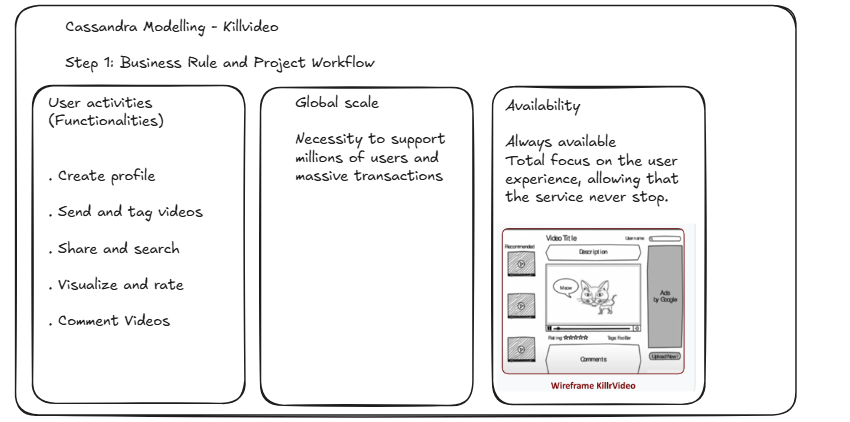
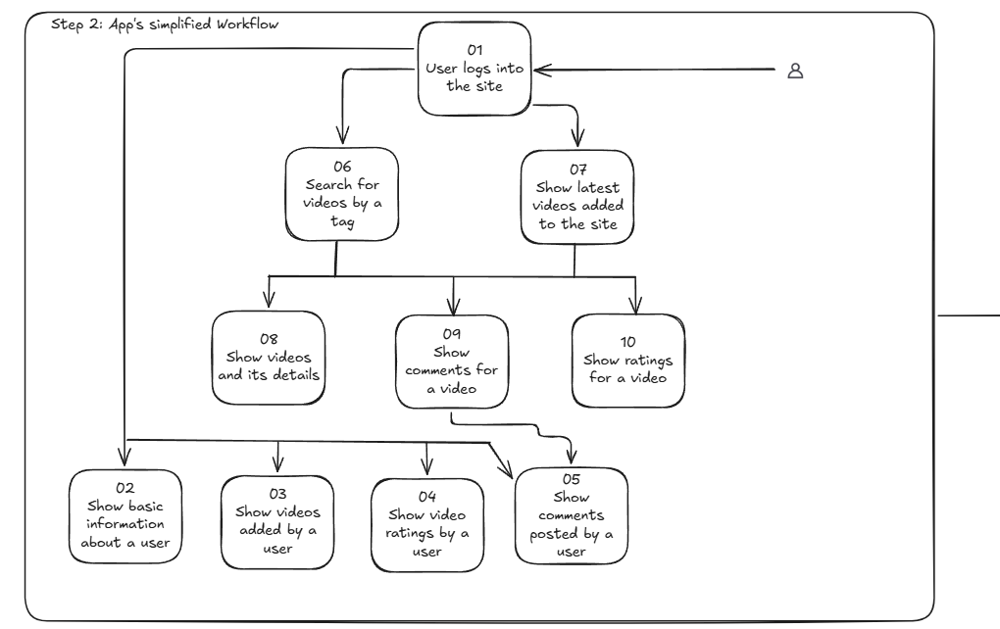
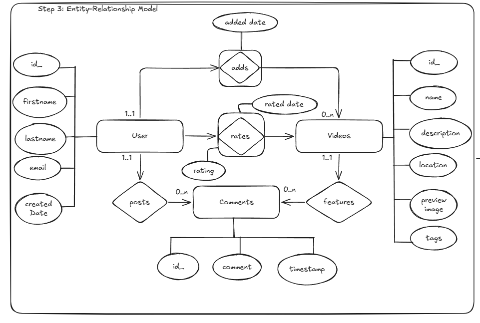
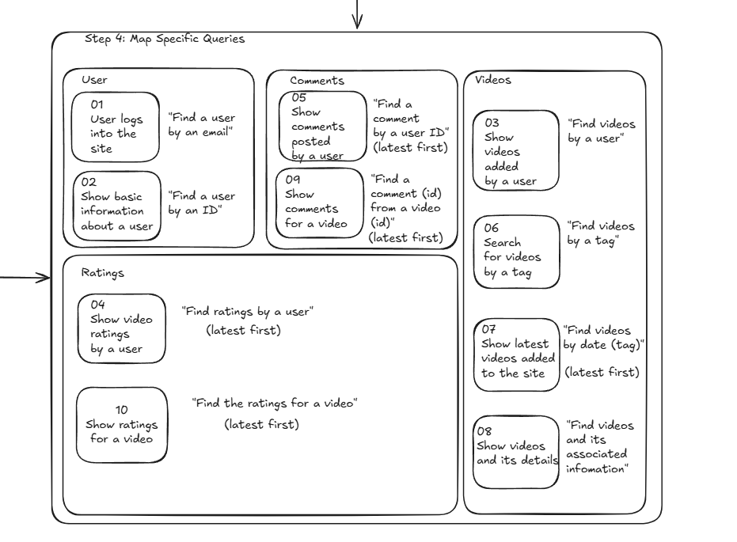

In this file we explore how this project was modelled.

# Project Modelling - Killrvideo
This project was modelled in the following manner:

## 1.1. Business Rule and Workflow
>**Image: Step 1**

## 1.2. App's simplified Workflow
>**Image: Step 2**

## 1.3. Entity-Relationship Model
>**Image: Step 3**

## 1.4. Specific Queries
>**Image: Step 4**

